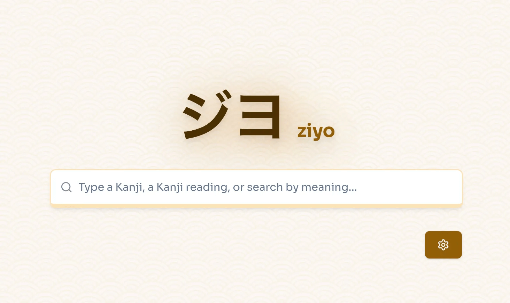

<h1 align="center">Ziyo</h1>

<p align="center">

<br/>
<i><a href="https://ziyo.nourman.com" target="_blank">ziyo.nourman.com</a></i>
</p>

**Ziyo** (Japanese: ジヨ */jiyo/*) is a stupidly simple online Kanji dictionary and search engine.

With Ziyo, you can search across thousands of kanji and view its readings, meanings, variations, and example sentences. It is targeted for Japanese learner who wants to do a quick but deep search about a kanji.

**Search a kanji by:**

- Onyomi reading (Kana/Latin)
- Kunyomi reading (Kana/Latin)
- Chinese Mandarin reading (Pinyin readings)
- Korean reading (Hangul/Latin - Hanja readings)
- Meanings (in English)

## Features
- Search and browse Kanji characters.
- Detailed information for each Kanji, including meanings, readings, and examples.
- User-friendly interface. With romaji support for those who are not familiar with kana.
- Opengraph image for quick sharing on social media.

<p align="center">
<br/>
<i>Open Graph image for Kanji page</i>
</p>

## Technologies used

- Next.js for frontend
- Hono.js for backend
- Tailwind + Shadcn UI
- Typesense (search engine)
- Nx Monorepo
- pnpm

## Development

```sh
# Clone the repository
git clone https://github.com/masnormen/ziyo.git
cd ziyo

# Install dependencies
pnpm install

# Start the development server for both frontend and backend
pnpm dev
```

Open your browser and go to `http://localhost:3000` to view the frontend application.

## License
This project is licensed under the MIT License.